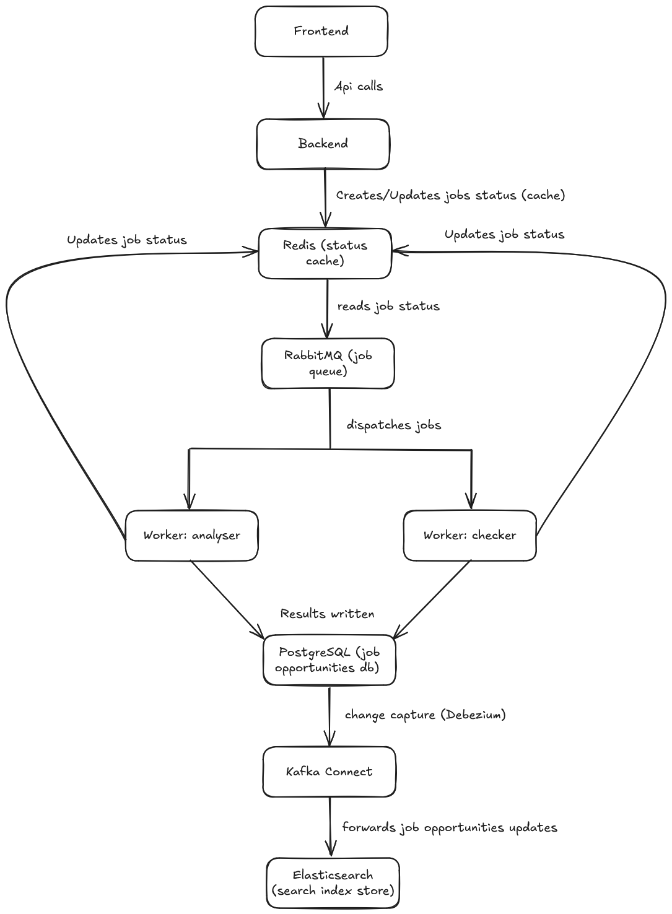

# Contributing to Play2Path & DeepSearchJobs

Thank you for your interest in contributing to **Play2Path** and its module **DeepSearchJobs**!
We truly appreciate your time, effort, and ideas to help us improve the platform.

If you have any questions, feel free to contact us at:
📧 **[abdelwakil.benabdi@play2path.com](mailto:abdelwakil.benabdi@play2path.com)**

If you encounter any problem with the project, please **open an issue** on GitHub so we can address it quickly.

---

# Current Architecture

DeepSearchJobs system is built as a distributed job-processing architecture composed of several services working together.
Below is an overview of how the platform processes user requests and manages asynchronous jobs:



This architecture enables:

* **Asynchronous job execution** using RabbitMQ + Workers
* **Real-time job status** via Redis
* **Persistent job opportunities storage** in PostgreSQL
* **Automatic search indexing** through Kafka Connect to Elasticsearch

---

# 🚀 Getting Started (Local Development Setup)

To set up the project locally, please install the following dependencies first:

### **Required software**

* **PostgreSQL**
* **Node.js**
* **Redis**
* **Nodemon**
* **npm**
* **Docker**
* **poetry**

### **1. Create your environment files**

From the provided `.env.example` file, you must create `.env` files in the following directories:

```
/backend/db/.env
/worker_async/.env
/worker_sync/.env   (optional)
```

### **2. Start the development environment**

Once all dependencies are installed and environment files are created, simply run the following script from the **root of the project**:

```
./launch_dev_mode.sh
```

This will start all required services automatically.

### **3. Open the application**

Once the dev environment is running, open a browser and navigate to:

```
http://localhost:5173
```

You’re now ready to start developing!

---

# 🧪 Testing the Application

A file named **[`test.xlsx`](./data/test.xlsx)** is included in the project and can be used to test the program's behavior and features.
Feel free to use and modify it during development to validate your changes.

---

# 🔧 How to Contribute

We welcome all types of contributions: bug fixes, new features, documentation improvements, and more.

### **1. Fork the repository**

Click the **Fork** button to create your own copy of the project.

### **2. Create a new branch**

Use a descriptive branch name:

```
git checkout -b feature/your-feature-name
```

### **3. Make your changes**

Implement your updates following the project structure and coding standards.

### **4. Commit your work**

```
git commit -m "Add: your feature or fix description"
```

### **5. Push the branch**

```
git push origin feature/your-feature-name
```

### **6. Open a Pull Request**

Go to your fork on GitHub and create a **Pull Request** to the main repository.

### ❗ If something goes wrong

If you find a bug, unexpected behavior, or something unclear in the documentation, please **open an issue** so we can investigate and improve the project.

We will review your PR or issue as soon as possible.

---

# 🐳 Optional: Full Docker Compose Setup

If you prefer not to install all dependencies manually or want a faster development setup, you can request a **full Docker Compose configuration** for local development (similar to the one provided for production).

This setup will handle:

* PostgreSQL
* Redis
* Backend services
* Workers
* Frontend environment
* Any required support containers

Feel free to reach out or open an issue if you'd like this Docker Compose setup added or customized for your workflow.

---

# 🙏 Thank You

Your contributions help make Play2Path better for everyone.
We’re grateful for your support and look forward to seeing what you build!
