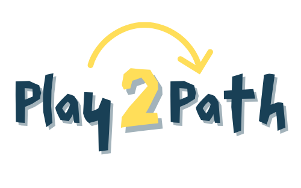

<p align="center">
  
</p>

<p align="center">
  <a href="LICENSE">
    
  </a>
  <a href="https://www.play2path.com/">
    
  </a>
  <a href="https://www.deepsearchjobs.com/">
    
  </a>
</p>

<p align="center">
  <a href="https://x.com/play2path" target="_blank">
    
  </a>
  <a href="https://www.linkedin.com/company/play2path" target="_blank">
    
  </a>
</p>

## DeepSearchJobs

**DeepSearchJobs** is a core module of the [Play2Path](https://www.play2path.com) ecosystem.  
Its purpose is to **find and extract unique job opportunities** from sources that are often overlooked and **not available on major platforms** such as [LinkedIn](https://www.linkedin.com), [Indeed](https://www.indeed.com), [Glassdoor](https://www.glassdoor.com), [Monster](https://www.monster.com) etc.

Unlike traditional job boards, DeepSearchJobs focuses on **hidden, high-value, niche, or hard-to-access opportunities**, offering users unique insights into the job market.

This module powers part of Play2Path’s advanced job-discovery engine by combining:

- Smart scraping
- Asynchronous job ingestion
- Worker-based processing
- Data enrichment and cleanup

We are continuously improving the module, and **you are welcome to contribute**!  
👉 See the **[Contributing Guide](./CONTRIBUTING.md)** to get started.

If you find this project useful or appreciate the work, **please consider leaving a ⭐ star on the repository, it helps a lot!**

---

## ❓ Why DeepSearchJobs?

From personal experience and from watching friends, relatives, and colleagues struggle, it has become clear that **finding a job is becoming harder every year**.
Traditional job platforms are saturated, and the competition is extremely high. Everyone applies to the same listings…

To succeed in such a crowded environment, it’s essential to **increase the variance** — to look where others *aren’t* looking.

Across the web, thousands of **unique job opportunities** exist that are *not pushed on the main platforms*, either because:

* They are published on niche websites
* They appear on small company pages
* They are hidden in specialized communities
* They are poorly indexed or never aggregated

**DeepSearchJobs** exists to reveal these hidden opportunities.

It focuses specifically on discovering **low-competition, high-value job postings** that most job seekers never see, giving Play2Path users a genuine edge in their job search.

On top of that, **we also fetch direct contacts whenever available** — hiring managers, HR emails, founders, or team leads.
Having the right contact dramatically increases your chances of being *seen*, *considered*, and *fast-tracked*.

Together, this creates a powerful advantage:
👉 More unique job opportunities
👉 Less competition
👉 Direct ways to reach the right people

---

## ▶️ How to Use DeepSearchJobs

You can use **DeepSearchJobs** in two ways:

### **1. Use Play2Path Online**
The simplest option is to use the full platform directly:

👉 **Visit : https://www.play2path.com**

There, DeepSearchJobs runs automatically and retrieves unique job opportunities for you.

---

### **2. Run DeepSearchJobs Locally with Your Own Data**

If you want to run the module yourself, you can provide your own data sources using a simple **`.xlsx` file** or using the [data provided](./data) (feel free to contribute to this list).

A reference file is provided here:

* **[`test.xlsx`](./data/test.xlsx)**

You can create your own `.xlsx` file by following the same structure.

#### **Minimum required information**

* **Company Name** (mandatory)

#### **Optional (recommended for faster & more accurate scraping)**

If you have additional data, DeepSearchJobs will process companies much more quickly:

* Company website
* Internal career page
* External career page

The more info you provide, the better the scraping performance.

▶️ **Run the Module**

Once your `.xlsx` file is ready, simply launch the following script:

```bash
./launch_prod_mode.sh
```

When the process finishes, open:

👉 **[http://localhost:3000](http://localhost:3000)**

You're all set! DeepSearchJobs will be running locally!

---

### 🎥 Video Tutorial

A full video tutorial is available here:

👉 **[Watch the tutorial](https://youtu.be/t6BJGXQuImA)**

---

## Potential Improvements

DeepSearchJobs is an evolving module, and there are several areas where contributors can help push it even further.
Here are some ideas currently on the roadmap:

* [ ] **Better code refactoring**

* [ ] **Improve data reliability**
  Enhance validation, detection of broken sources, deduplication logic, and consistency across ingested data.

* [ ] **Support multiple contexts running inside a single worker**
  Better parallelism, smarter resource usage, and more scalable ingestion pipelines.

* [ ] **Generate resumes tailored to each job offer**
  Already available on **[Play2Path](https://www.play2path.com)** — the goal is to integrate this capability directly into the local module.

* [ ] **Improve scraping speed**
  Through optimized concurrency, caching, batching requests, or smarter prioritization.

* [ ] **Improve stealthiness of the scraping**
  Techniques to reduce blocking (already implemented: header rotation, proxy rotation, user behavior simulation)

---

## 📄 License

This project is licensed under the **GNU Affero General Public License v3.0 (AGPL-3.0)**.

This means:

* You are free to **use**, **modify**, and **redistribute** the software.
* If you **modify** the code and make it available to users over a network, you **must also make your modified source code available** under the same license.
* Any derivative work must also remain **open-source** under **AGPL-3.0**.
* The original copyright and license notices must be preserved.

👉 For full legal details, see the official license text:
**[GNU AGPL v3.0](https://www.gnu.org/licenses/agpl-3.0.html)**
